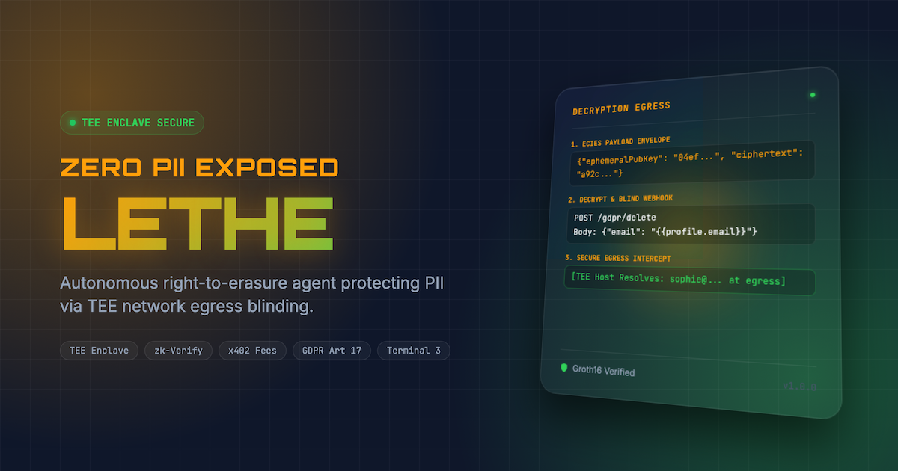
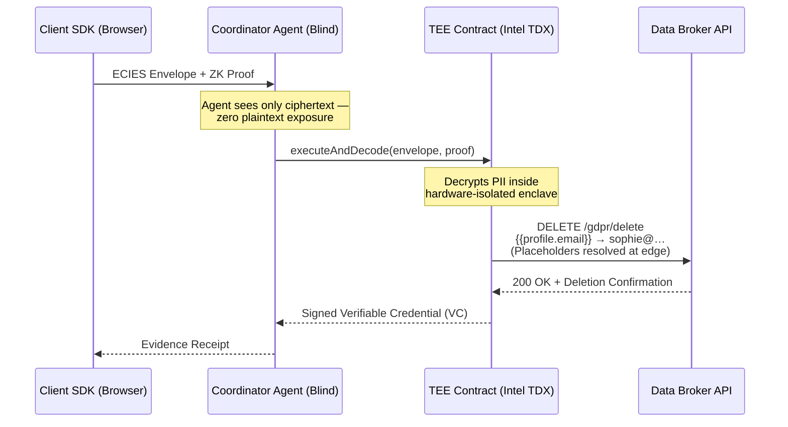

<div align="center">
  

  <h1>Lethe 🌊</h1>
  <p><em>Autonomous right-to-erasure agent protecting PII via secure TEE enclaves and network egress blinding.</em></p>
  

  <br/>

  [](https://lethe.edycu.dev)
  [](https://agent.lethe.edycu.dev)
  [](https://youtu.be/lethe-demo-video)
  [](https://lethe.edycu.dev/pitch.html)
  [](https://dorahacks.io/hackathon/t3adkdevchallenge)

  <br/>

  
  
  
  
  
  
  
  
  
  [](https://github.com/edycutjong/lethe/actions/workflows/ci.yml)

</div>

---

> ⚡ **Reviewers / judges:** fastest path is **[GOLDEN_PATH.md](docs/GOLDEN_PATH.md)** — the entire flow in ~2 minutes, **no credentials**. Bug-bounty track: **[SDK_AUDIT.md](docs/SDK_AUDIT.md)** (confirmed, code-cited findings from the real `@terminal3` SDK).

## 📸 See it in Action

<div align="center">
  
</div>

> **Onboard Wallet** → **Authorize Agent Delegation** → **Batch Fund x402 Micropayments** → **Trigger Blinded Erasure Loop** → **Cryptographic Purge & Self-Destruct**.

---

## 💡 The Problem & Solution

Sophie Miller discovered her phone number, physical address, and SSN listed on dozens of public data-broker sites. When she attempted to exercise her legal right to be deleted (GDPR Art. 17 / CCPA), she was met with a paradox: opt-out portals demanded that she upload *more* sensitive credentials—like a full SSN scan and utility bills—to verify her identity. These opt-out systems are centralized data honeypots. If any broker or the crawler agent routing the request gets breached, Sophie's PII is leaked. 

**Lethe** solves this paradox. Sophie encrypts her PII locally in her browser. The coordinator agent routes the request but remains blind. Decryption and validation happen exclusively inside the hardware-isolated TEE secure enclave, and the final webhook dispatches the data securely replacing placeholder markers at the secure edge.

Upon campaign completion, Lethe triggers a self-destruct sequence to zeroize its own volatile memory and de-authorize session DID tokens. **The last act of the agent is to forget you.**

### Key Features:
- 🛡️ **Intel TDX Secure TEE Enclaves**: Decrypts user PII envelopes and processes erasures inside isolated hardware boundaries.
- 🔒 **Zero-Knowledge Proofs**: Groth16 proofs verify ownership of emails/SSNs offline before executing deletion request webhooks.
- ⚡ **Egress Placeholder Blinding**: Uses `http-with-placeholders` API to blind unsecure network layers and route requests securely.
- 🔑 **x402 Micropayments**: Requires verified micropayment hashes for each request to protect broker APIs from spam.
- 💀 **Zeroization & Purging**: The final act of the agent is to zeroize private keys in RAM and trigger `user-removal` to wipe delegation sessions.

---

## 🏗️ Architecture & Tech Stack

| Layer | Technology |
|---|---|
| **Dashboard UI** | Next.js 16 (App Router), React 19, Tailwind CSS v4 |
| **Coordinator Agent** | Node.js, Express, TypeScript, Ethers.js |
| **Secure Enclave** | Intel TDX TEE |
| **TEE Contract** | Rust compiled to WebAssembly WASIP2 (`wasm32-wasip2`) |
| **Client SDK** | TypeScript, `secp256k1` (ECDH), `aes-256-gcm` |
| **CLI Tool** | Node.js, Commander.js |
| **E2E Testing** | Playwright |
| **Performance Audit** | Lighthouse CI |

### Enclave Egress Flow:


---

## 🛡️ Sponsor Host API Integration Defense

Lethe utilizes 6 host API namespaces from the **Terminal 3 Agent Dev Kit (ADK)**:

1.  **`user-removal`:** Coordinates physical de-authorization of the delegation session DID, deleting credentials from the host ledger.
2.  **`http-with-placeholders`:** Executes blind HTTP egress webhook calls by replacing placeholdered variables inside the secure TLS tunnel.
3.  **`user-profile`:** Retrieves isolated encrypted customer profile data at rest.
4.  **`signing`:** Enclave-side signing service used to generate signed W3C Verifiable Credentials proving erasure receipt validation.
5.  **`kv-store`:** Namespace-isolated key-value maps (`lethe:broker`, `lethe:job`, `lethe:evidence`) storing broker templates and execution records.
6.  **`authorisation`:** Verifies broker grid delegation signatures against tenant registries.

---

## 🚀 Getting Started

### Prerequisites
- Node.js >= 20.9.0
- Python >= 3.11
- Rust >= 1.75
- target wasm32-wasip2:
  ```bash
  rustup target add wasm32-wasip2
  ```

### Installation & Local Setup

1. **Clone the repository:**
   ```bash
   git clone https://github.com/edycutjong/lethe.git
   cd lethe
   ```

2. **Install all dependencies:**
   ```bash
   make bootstrap
   ```

3. **Compile and Build all components:**
   ```bash
   make build
   ```

4. **Setup Environment:**
   ```bash
   cp .env.example .env
   ```

5. **Run Dashboard UI:**
   ```bash
   cd ui && npm run dev
   ```

---

## 🧪 Testing & CI

We enforce a **6-stage pipeline**: Quality → Security → Build → E2E → Performance → Deploy.

```bash
# ── Workspace Automation ─────────────────────
make ci               # Run full code quality pipeline (lint, typecheck, tests)
make e2e              # Run Playwright E2E tests (demo mode)
make lighthouse       # Run Lighthouse CI performance audit
make security-scan    # Run high/critical security scan
make check-readiness  # Run the official readiness suite check
make verify-offline   # Run the enclave PII leak offline verification
```

| Layer | Tool | Status |
|---|---|---|
| Code Quality | ESLint + TypeScript | ✅ Passed |
| Unit Testing | Jest (Agent) + Cargo test (Contract) | ✅ Passed |
| E2E Testing | Playwright (3 suites) | ✅ Passed |
| Security (SAST) | CodeQL | ✅ Active |
| Security (SCA) | Dependabot + npm audit | ✅ Clean |
| Secret Scanning | TruffleHog | ✅ Configured |
| Performance | Lighthouse CI | ✅ Configured |

---

## 📁 Project Structure

```
lethe/
├── docs/                     # README assets (hero, pitch deck, mockup)
│   ├── readme-hero.png
│   └── readme.png
├── sdk/                      # TypeScript SDK (@edycutjong/lethe-sdk)
├── contract/                 # Rust WASM Component Contract source
├── agent/                    # Node.js Coordinator Agent
│   ├── src/index.test.ts     # Jest Integration tests
│   └── src/index.ts          # Agent logic
├── ui/                       # Next.js Dashboard App
│   ├── e2e/                  # Playwright E2E tests
│   └── src/app/              # Dashboard pages
├── cli/                      # @edycutjong/lethe-cli executable
├── scripts/                  # Seeding, verification and leak checks
├── Makefile                  # Local Automation targets
├── package.json              # Workspace script coordinator
└── README.md                 # You are here
```

---

## 🧠 Terminal 3 ADK Dev Challenge: Audit & Discovered Bugs

This project is submitted to the **Terminal 3 ADK Dev Challenge 2026** as part of the **Vouch Suite** (a 5-enclave system including Epoch, Lethe, Silo, Synod, and Visor).

While building these enclaves we audited the T3 ADK host APIs and SDK and documented **10 concrete onboarding bugs and documentation gaps** — each with a repro, impact, and the workaround we shipped — for the **Track 2 bug bounty**.

➡️ **See [BUGS.md](BUGS.md)** for the full audit. Highlights for Lethe:

- **Bug #2 — `kv-store` interface discrepancy:** WIT declares `get(map-name, key)` but the C ABI is flat `(key_ptr, key_len)` (Lethe `scan`s deletion campaigns through the flat shape).
- **Bug #4 — `signing` has no VC helper:** templates call `host_signing_issue_vc`, but WIT only exposes raw `sign` (Lethe issues a deletion-proof VC per broker).
- **Gap #8 / #9 — rollback boundary & `outbox` idempotency window** are unspecified — both affect the erasure campaign's all-or-nothing guarantee.
- **Gap #10 — `user-removal` ordering vs. in-flight egress** is undocumented — Lethe's self-destruct must run strictly after the last PII-blind broker request resolves.

---

## 📄 License

[MIT](LICENSE) © 2026 Edy Cu

---

## 🙏 Acknowledgments

Built for the DoraHacks T3ADK Launch Edition 2026. Thank you to the Terminal 3 team for the enclaves environment and development tools.
